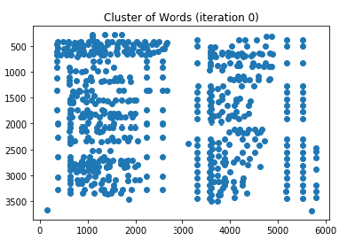
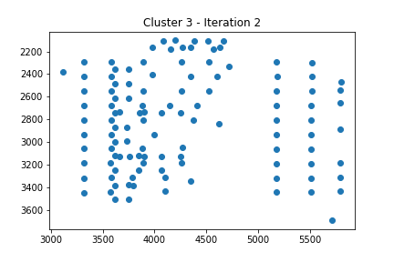
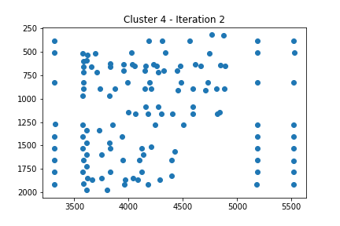
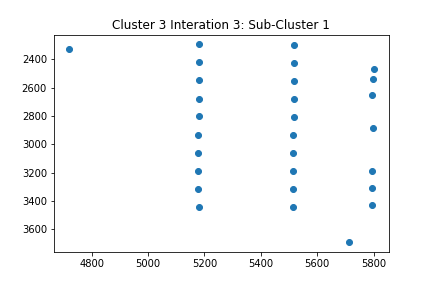

# UC Davis DataFest 2019

#### The Challenge 
The UC Davis Library has over 200 scanned catalogs spanning nearly a 50 year period. How do we translate a scanned image
into usable data for economists, historians, archivists, and other researchers?
#### Hypothesized Solution
Unstructured text recognition using Python and Spyder. Utilize Pandas, NumPy, Matplotlib, and sklearn. Clustering 
by feature location was done with K-Means machine learning algorithm.

[DataFest Website](http://ds.lib.ucdavis.edu/eventscalendar/datafest-wine-catalog-challenge/)

## Libraries
* psycopg2 - DB API 2.0 compliant PostgreSQL driver
* matplotlib - plotting library for NumPy
* pandas - software library for data manipulation and analysis
* scikit learn - machine learning library
* numpy - general-purpose array-processing package

### Prerequisites
* Python 3.7
* UC Davis VPN (optional - used for viewing the wine catalouges)
  - [VPN - Instillation and Use Instructions](https://www.library.ucdavis.edu/service/connect-from-off-campus/)
    - VPN can only be installed if you are a UC Davis student/staff

## Running the Program
* Once program is run, you will see a series of scatter plots titled, 'Cluster of Words', each with a cooresponding iteration, along with a 
  series of line graphs titled, 'The Elbow Method'. A .png file for each of the scatter plots will automatically be saved to the
  working directory.
  - Iteration 0: Scatter plot of all the words that appear on the desired catalog before any manipulation has been done.
  
  
  
  - Iteration 1: Scatter plot of all the words, except this time they are color coded based off of what cluster they fall into (NOTE:
    The elbow method was used to determine the optimal number of clusters for each iteration of the data. An image of the line graph
    used for the elbow method can be seen within the terminal.)
    
    
    
  - Iteration 2: Each of the clusters from iteration 1 are placed within their own dataframe, and these clusters are then broken up into     their respective ideal number of clusters. The result should be a minimum of four new scatter plots.
  
  
  
  
  
  
  
  
  
  - Iteration 3 (optional): If you look at the scatter plots and notice that one can still be broken down nicely into groups of 
    different clusters, then you can enter the name of the cluster in question, and it will be broken down into its constituent sub-
    clusters. A .png for each of the scatter plots created will be saved within the working directory.
    - You may re-run iteration 3 on any of the clusters as many times as desired.
    - An example of running a third iteration on cluster 3 can be seen below:
    
    
    
    
    
    
    
* If you wish to see the actual scan of the catalog in question, the link will automatically be coppied to your clipboard and you can 
  simply paste to your browser. 
  - NOTE: The website can only be accessed if you are using a UC Davis VPN
* This program can be run on each individual catalog. To figure out the ID of the catalog in question, go to line 42 of the program. By 
  default, you will see that catalog "d7q36x-009" is being used. To run the program using a different catalog, open the dataframe 
  titled 'page', locate the column titled 'page_ark', and copy/paste any desired ark into line 42, replacing the default ark. 

## Authors

* **William Schmidt** - [Wil's LikedIn](https://www.linkedin.com/in/william-schmidt-152431168/)
* **Isaiah Valencia** - [Isaiah's LikedIn](https://www.linkedin.com/in/isaiah-valencia-4b1531164/)
* **Christopher Ton** - [Christopher's GitHub](https://github.com/chriztopherton), [Cristopher's LikedIn](https://www.linkedin.com/in/chrton/)

## Acknowledgments

* Thank you to UC Davis Data Science Initative for hosting this event!
  - [Data Science Initiative](http://dsi.ucdavis.edu/)
